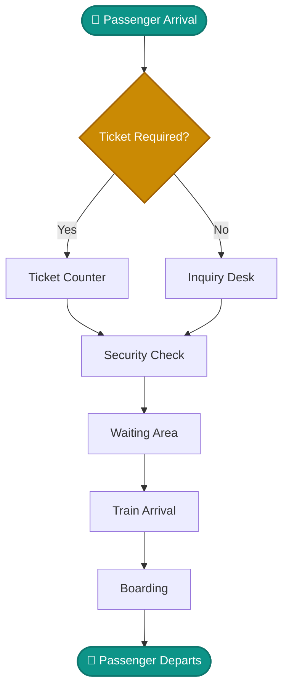

<div align="center">
  <h1>🚆 Karachi Railway System</h1>
  <h3>Queue Simulation & Analysis Suite</h3>

  
  
  
  

</div>

---

## 📖 Overview

Desktop simulation software for **Karachi Railway**, built with C# and WPF on **.NET 8**. 
The application acts as a digital twin for passenger queues, allowing analysts and administrators to model passenger flow through various stages of the railway station. It supports three distinct single-server queue models (**M/M/1, M/G/1, G/G/1**) and features a dynamic UI for exploring passenger flow, live metrics, and comprehensive statistical analysis.

---

## ✨ Features & Capabilities

- 🎨 **Premium UI/UX**: Sleek Light Green and White color palette with Gold/Yellow accents, using the modern **Outfit** typography.
- 📺 **Animated Flow Diagram**: Watch passengers traverse through the station in real-time.
- 🧮 **Simulation Table**: Inspect row-by-row passenger probabilities, inter-arrival times, service times, and wait times.
- 📈 **Live Metrics & Graphs**: Visual Cartesian charts powered by `LiveChartsCore` for tracing Wait ($W_q$) and Queue Length ($L_q$) trends.
- 📋 **Comprehensive Reporting**: Drill-down history of all simulation runs, exportable for external analytics.
- ⚙️ **Custom Parameters**: Adjustable Arrival Rates ($\lambda$), Service Rates ($\mu$), and Playback Speeds (`0.1x` to `3x`).

---

## 🔀 Passenger Flow Architecture

The simulation mirrors a real-world passenger journey through a railway terminal:



---

## 📐 Supported Queue Models

### M/M/1
- **Inter-arrival times**: Exponential ($\lambda$)
- **Service times**: Exponential ($\mu$)
- Uses standard exact queueing formulas.

### M/G/1
- **Inter-arrival times**: Exponential ($\lambda$)
- **Service times**: General (Gamma distribution), controlled by Service CV ($C_s$)
- Uses Pollaczek–Khinchine approximation.

### G/G/1
- **Inter-arrival times**: General (Gamma distribution), controlled by Arrival CV ($C_a$)
- **Service times**: General (Gamma distribution), controlled by Service CV ($C_s$)
- Uses Kingman’s approximation for wait-time metrics.

---

## 🏗️ Project Structure

```text
KarachiRailwaySystem/
│
├── 📂 src/                             # Application Source Code
│   ├── 📦 KarachiRailway.Simulation/   # Core queue mathematics, models, and simulation engine
│   └── 📦 KarachiRailway.Desktop/      # WPF Application (ViewModels, Views, UI components)
│
├── 📂 tests/                           # Testing Suite
│   └── 🧪 KarachiRailway.Tests/        # xUnit / NUnit unit tests for math and logic validation
│
├── 📄 KarachiRailwaySystem.sln         # Standard Visual Studio Solution file
├── 📄 KarachiRailwaySystem.slnx        # Modern Solution XML file
└── 📄 run.bat                          # Quick-start batch script for Windows users
```

---

## 🚀 Getting Started

### Prerequisites
- [.NET 8.0 SDK](https://dotnet.microsoft.com/en-us/download/dotnet/8.0) or higher.
- Windows OS (Required for WPF `net8.0-windows` target).

### Run Locally

Launch the application directly using the .NET CLI:

```bash
# Build the entire solution
dotnet build KarachiRailwaySystem.sln

# Run the WPF Desktop App
dotnet run --project src/KarachiRailway.Desktop/KarachiRailway.Desktop.csproj -c Debug
```

### Run Tests

Execute the unit tests to ensure all mathematical models are accurate:

```bash
dotnet test KarachiRailwaySystem.sln -c Debug
```

---

## 📦 Build Executable (Release)

Generate a self-contained, single-file executable for deployment on machines without .NET installed:

```powershell
Get-Process KarachiRailway.Desktop -ErrorAction SilentlyContinue | Stop-Process -Force

dotnet publish src/KarachiRailway.Desktop/KarachiRailway.Desktop.csproj `
  -c Release -r win-x64 --self-contained true `
  /p:PublishSingleFile=true `
  /p:PublishTrimmed=false `
  /p:IncludeNativeLibrariesForSelfExtract=true
```

> 💡 **Output location:**  
> `src/KarachiRailway.Desktop/bin/Release/net8.0-windows/win-x64/publish/KarachiRailway.Desktop.exe`
